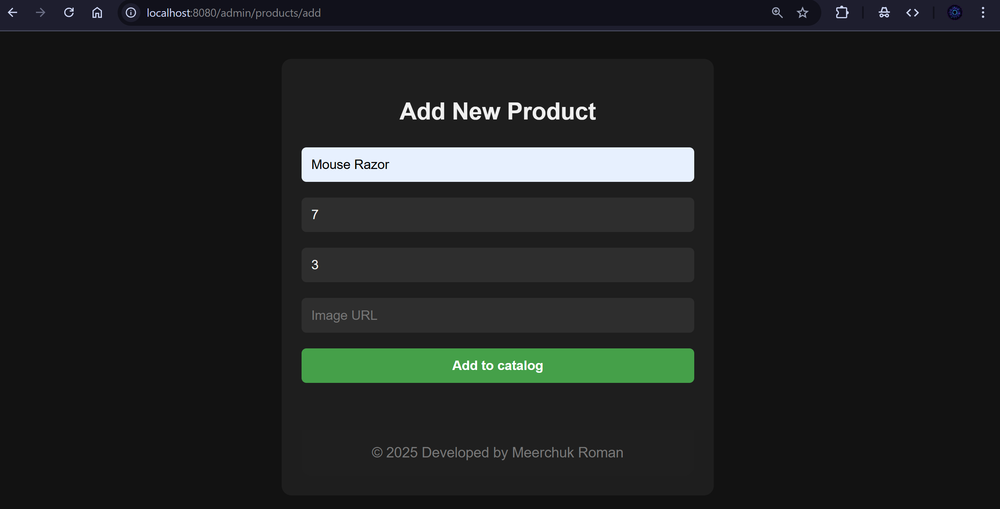
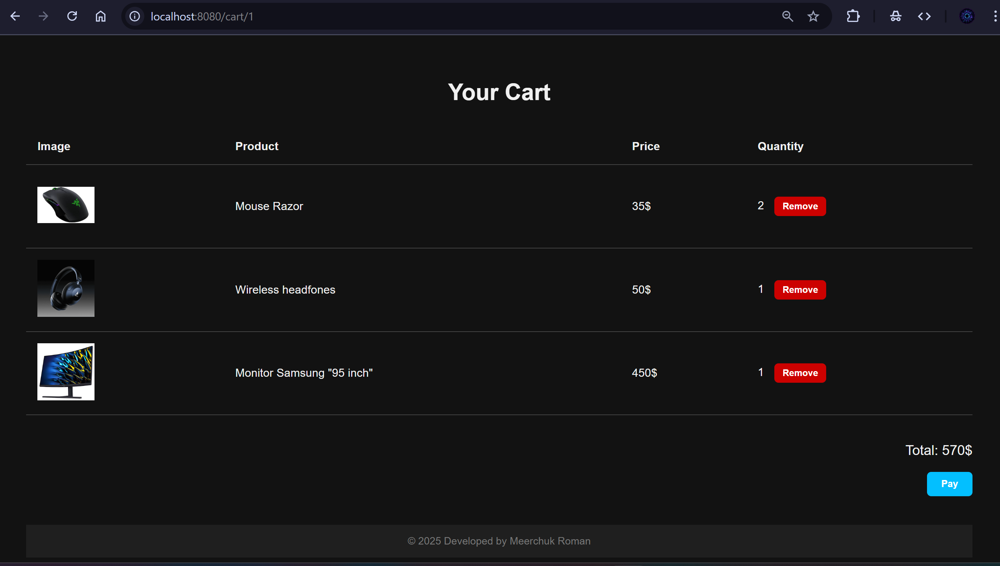
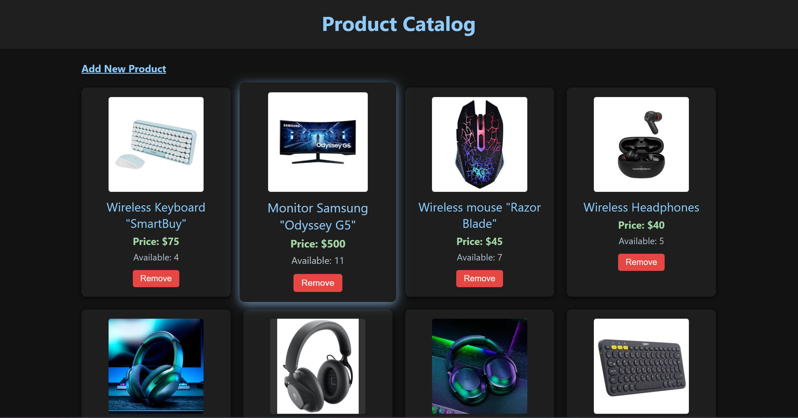
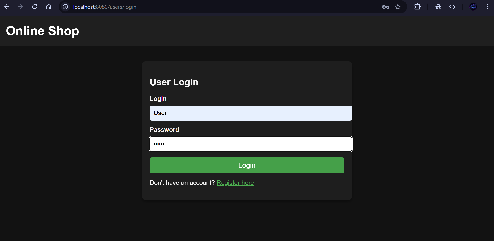
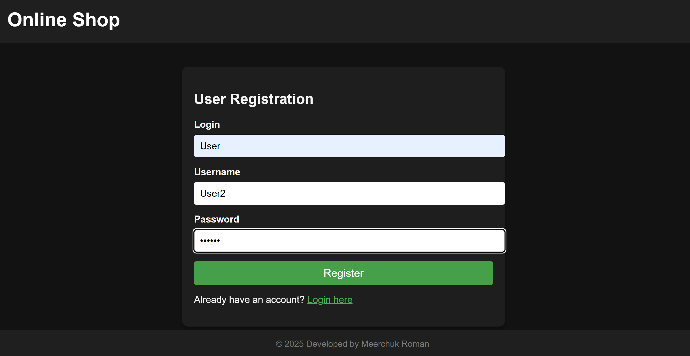

# Online Shop

A learning project of an online store built with **Spring Boot, Hibernate, and PostgreSQL**.

## Features
- User registration and login
- Product catalog browsing
- Adding products to the cart
- Viewing the cart
- Placing orders
- Admin panel for product management

## Technologies
- Java 21
- Spring Boot
- Hibernate / JPA
- PostgreSQL
- Gradle
- Thymeleaf
- Spring Security
- Mapstruct

## Getting Started

1. Clone the repository:
   ```bash
   git clone https://github.com/username/shop.git

## Screenshots






